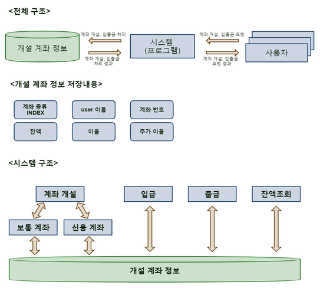
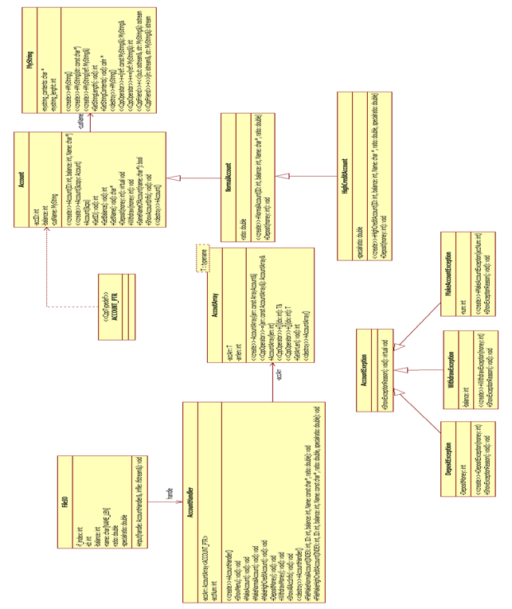

# MiniBankingSystem

- 은행의 계좌개설 및 입출금을 간략하게 구현한 프로그램입니다.

# 개요

- 본 프로그램은 은행 계좌 개설 및 입출금 기능을 Visual C++로 구현한 것 입니다.

- 본 프로그램은 '보통 예금 계좌'와 '신용 거래 계좌'를 구분지어 개설하도록 구현하였습니다.

- 각 계좌에서는 기본 이율을 지정할 수 있고, '신용 거래 계좌'는 별도의 등급제를 적용하여 각 등급 별로 추가 이율을 받을 수 있도록 구현하였습니다.

# 시스템 구조도

- 본 프로그램은 사용자가 계좌 개설, 입출금, 잔액조회 등의 기능을 요구하면 시스템이 처리하여 처리한 정보를 개설 계좌 정보에 기록하는 구조 입니다.

- 주요 기능을 클래스화 하여 관리하며, 주요 정보도 클래스화 하여 부모 클래스(Account Class)를 상속받아 저장하는 구조 입니다.

# Class Diagram

# 개발 환경

- 운영 체제 : Windows 7 Professional K 64bit

- 컴파일러 버전(언어) : _MSC_VER 1916 (visual C++)

- VC++ version : 14.16

- CPU : Intel(R) Core(TM) i7-4790 CPU @3.60GHz

- 메모리(RAM) : 8GB

- IDE : Microsoft Visual Studio Community 2017 ver 15.9.11

# 구동 영상 URL

[바로 가기](https://youtu.be/dIxZ4n0Q2NU)

# 추후 개선사항

- 계좌 간 송금 기능, 통장 거래 기록 조회 등을 추가하여 사용자에게 제공되는 서비스 기능을 늘일 필요가 있다.

- '신용 거래 계좌' 개설 과정에서 신용등급 입력 부분에 올바르지 않은 문자를 입력할 경우 오류 메세지가 출력 되게 해야 한다.

- 연결리스트로 재구현하여 메모리의 낭비를 막아야 한다.

- 데이터 삭제 기능을 추가하여 프로그램 실행으로 데이터의 저장, 삭제가 가능하도록 구현 한다.
